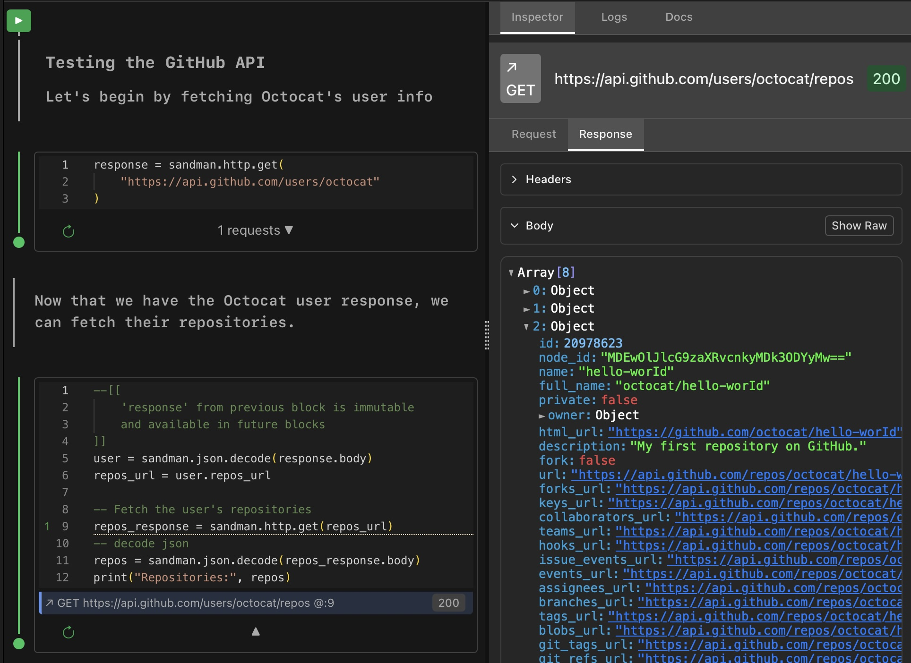

# Sandman

**Executable notebooks for HTTP APIs**

Sandman is a tool for creating living API documentation and testing workflows. Write interactive notebooks that combine Lua code with Markdown—make HTTP requests, spin up servers, test webhooks, and document your API workflows in git-friendly files.

## What is Sandman?

Sandman lets you write API workflows as executable notebooks. Each notebook is a Markdown file containing blocks of Lua code that run sequentially with shared state. It's like Jupyter for HTTP APIs—but optimized for API testing, mocking, and documentation.

**Desktop Editor + HTTP Engine**: Sandman is a desktop application that combines a notebook-style editor with a powerful HTTP engine. Write your Lua scripts in the interactive editor, and the built-in engine executes them—making HTTP requests, spinning up servers, and managing all the networking for you. Everything runs locally on your machine, keeping your API keys and data secure.

**Markdown Native**: At its core, Sandman is built around Markdown. Your notebooks are just plain `.md` files with executable Lua code blocks. Open them in any text editor, diff them in git, review them in pull requests—they're just Markdown. Sandman reads and writes the same Markdown format you already know, making your executable notebooks readable and editable anywhere.



## Getting Started

### Download

Download the latest version of Sandman for macOS from [GitHub Releases](https://github.com/markmeeus/sandman/releases/).

**Requirements:**
- macOS (Apple Silicon only for now)
- No other dependencies needed

### Quick Start

1. **Download and Install**
   - Download `Sandman-{version}-silicon.dmg` from the [releases page](https://github.com/markmeeus/sandman/releases/)
   - Double click and drag `sandman` app to your Applications folder
   - Open Sandman

2. **Create Your First Notebook**
   - Open a folder in Sandman
   - Create a new `.md` file (e.g., `my-first-test.md`)
   - Add a Lua code block with some executable code
   - Run it with `⌘+Enter` or click the Run button

3. **Start Building**
   - Mix Markdown documentation with executable Lua code
   - Chain requests together with shared state
   - Commit your notebooks to git like any other file

See the complete [documentation](https://sandmanapp.com) for API reference and advanced usage.

### Key Features

- 📝 **Executable Documentation** - Your docs and tests are the same file. If it runs, it's correct.
- 🔄 **Stateful Workflows** - Each code block builds on previous blocks' state. Chain requests together naturally.
- 🌐 **Client & Server** - Make HTTP requests *and* create HTTP endpoints in the same notebook.
- 📊 **Request Inspection** - Every HTTP request and response is automatically captured and inspectable.
- 📦 **Git-Native** - Plain Markdown files with executable Lua blocks. Perfect for version control.
- 🖥️ **Desktop App** - Interactive app for macOS (Windows & Linux coming soon).

## Quick Examples

### Making HTTP Requests

```lua
-- Fetch data from an API
response = sandman.http.get("https://api.github.com/users/octocat")
print("Status:", response.status)

-- Parse JSON response
user = sandman.json.decode(response.body)
print("Username:", user.login)
print("Repos:", user.public_repos)

-- Use data from previous block in next request
repos_response = sandman.http.get(user.repos_url)
repos = sandman.json.decode(repos_response.body)
print("Found", #repos, "repositories")
```

### Creating HTTP Endpoints

```lua
-- Start a local HTTP server
server = sandman.server.start(8080)

-- Add a GET endpoint
sandman.server.get(server, "/hello", function(request)
    return {
        body = "Hello, " .. (request.query.name or "World") .. "!"
    }
end)

-- Add a POST endpoint
sandman.server.post(server, "/api/users", function(request)
    local data = sandman.json.decode(request.body)
    return {
        status = 201,
        body = sandman.json.encode({
            message = "User created",
            user = data
        })
    }
end)

print("Server running on http://localhost:8080")
```

### Testing Webhooks

```lua
-- Set up a webhook receiver
server = sandman.server.start(7010)

webhook_data = nil
sandman.server.post(server, "/webhook", function(request)
    webhook_data = sandman.json.decode(request.body)
    print("Received webhook:", webhook_data)
    return {body = "ok"}
end)
```

In another block, trigger the webhook
```lua
response = sandman.http.post("http://localhost:7010/webhook",
    {["Content-Type"] = "application/json"},
    sandman.json.encode({event = "test", timestamp = os.time()})
)

-- Verify the webhook was received
print("Webhook data:", webhook_data)
```

### Complete API Workflow

```lua
-- Authenticate
auth_response = sandman.http.post("https://api.example.com/auth/login",
    {["Content-Type"] = "application/json"},
    sandman.json.encode({
        email = "user@example.com",
        password = "secret"
    })
)

auth_data = sandman.json.decode(auth_response.body)
token = auth_data.token

-- Use token in subsequent requests
user_response = sandman.http.get("https://api.example.com/user/profile",
    {["Authorization"] = "Bearer " .. token}
)

profile = sandman.json.decode(user_response.body)
print("Logged in as:", profile.name)

-- Update profile
update_response = sandman.http.put("https://api.example.com/user/profile",
    {
        ["Authorization"] = "Bearer " .. token,
        ["Content-Type"] = "application/json"
    },
    sandman.json.encode({bio = "Updated from Sandman!"})
)
```

## Why Sandman?

**The Problem**: API documentation gets outdated the moment you write it. Postman collections live in proprietary formats. Integration tests are buried in code nobody reads.

**The Solution**: What if your documentation was executable? What if it lived in git, ran real requests, and proved itself correct every time?

Sandman notebooks are:
- **Human-readable** - Plain Markdown with Lua code blocks
- **Executable** - Run your docs to verify they work
- **Git-friendly** - Diff, merge, and review like any code file
- **Self-documenting** - Mix code with explanations naturally
- **Portable** - Just Markdown files, no proprietary formats

## Use Cases

- **Living Documentation** - Document endpoints with working examples
- **API Testing** - Create test suites that double as documentation
- **Workflow Testing** - Test multi-step API flows with real state
- **API Mocking** - Spin up mock servers to replace external dependencies
- **Integration Testing** - Test webhook receivers and API clients together
- **Onboarding** - New team members run notebooks to learn the API
- **Exploration** - Experiment with third-party APIs interactively

## Building from Source

If you want to build Sandman from source instead of downloading from releases:

1. Clone this repository
2. Install Elixir and Erlang (see `.tool-versions` for versions)
3. Run `mix deps.get` to install dependencies
4. Run `mix phx.server` to start the development server
5. For macOS app build, run `./build_all.sh`

*Windows, Linux, and CLI versions coming soon*

## Project Status

Sandman is in **active beta development**. It's functional and already useful for real work, but:

- ✅ **Working**: HTTP client, HTTP server, JSON/Base64/JWT utilities, notebook execution, request inspection
- 🚧 **In Progress**: CLI version, improved error handling, better code editor, more comprehensive docs
- 📋 **Planned**: Windows & Linux support, environment variables, CLI/CI/CD integration, Plugin system, Interactive Document UI components

Bug reports, feature requests, and contributions are more than welcome!

## Contributing

Contributions are welcome! Whether it's:
- 🐛 Bug reports
- 💡 Feature requests
- 📖 Documentation improvements
- 🔧 Code contributions

Please open an issue or pull request on GitHub.

## License

[See LICENSE file for details]

Made with ❤️ by developers tired of API docs that lie
